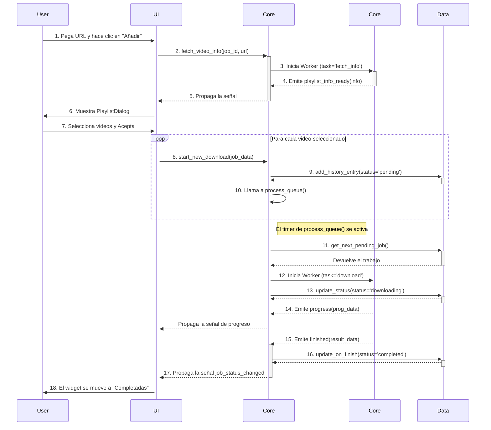

---

# Documentación Exhaustiva: Advanced Video Downloader

Este documento contiene la documentación completa del proyecto, dividida en las siguientes secciones:
1.  **README.md**: Información general del proyecto.
2.  **Guía de Usuario**: Instrucciones para el usuario final.
3.  **Arquitectura del Sistema**: Explicación técnica para desarrolladores.
4.  **Documentación de la API**: Detalles de cada módulo y clase.

---

## 1. README.md

### Advanced Video Downloader

**Advanced Video Downloader** es una aplicación de escritorio de código abierto, potente y profesional para descargar videos y playlists de diversas fuentes. Construida con Python, PyQt6 y yt-dlp, ofrece una interfaz gráfica moderna y un robusto backend que soporta descargas concurrentes, historial, programación y mucho más.

### ✨ Características Principales

-   **Descargas Concurrentes**: Descarga múltiples videos simultáneamente con un límite de hilos configurable.
-   **Sistema de Cola Avanzado**: Pausa, reanuda, cancela y reintenta descargas de forma individual.
-   **Soporte para Playlists**: Pega la URL de una playlist y selecciona qué videos deseas descargar.
-   **Historial Persistente**: Todas tus descargas se guardan en una base de datos local para futuras referencias.
-   **Organización con Tags**: Añade tags personalizados a tus descargas para categorizar y filtrar tu historial.
-   **Búsqueda Rápida**: Encuentra descargas pasadas instantáneamente buscando por título, URL o ruta de archivo.
-   **Programador de Descargas**: Configura descargas para que comiencen automáticamente en una fecha y hora futuras.
-   **Conversión de Formato**: Convierte videos a otros formatos (ej. MP3) automáticamente después de la descarga usando FFmpeg.
-   **Descarga de Subtítulos**: Configura y descarga automáticamente los subtítulos disponibles en los idiomas que prefieras.
-   **Configuración Personalizable**: Ajusta la ruta de descarga, el número de hilos, el tema de la aplicación, opciones de red y más.
-   **Importar/Exportar Configuración**: Guarda y carga tus ajustes en un archivo JSON, ideal para backups o para sincronizar entre diferentes equipos.

### 🛠️ Stack Tecnológico

-   **Lenguaje**: Python 3.10+
-   **Interfaz Gráfica (GUI)**: PyQt6
-   **Backend de Descarga**: yt-dlp
-   **Base de Datos**: SQLite
-   **Gestión de Concurrencia**: QThreadPool de PyQt6
-   **Empaquetado**: PyInstaller

### 📂 Estructura del Proyecto

```
video-downloader-advanced/
├── src/
│   ├── main.py                     # Punto de entrada de la aplicación
│   ├── core/                       # Lógica de negocio principal
│   ├── database/                   # Gestión de la base de datos
│   ├── ui/                         # Componentes de la interfaz de usuario
│   └── utils/                      # Módulos de utilidad
├── tests/                          # Suite de tests
├── resources/                      # Iconos y otros recursos
├── requirements.txt                # Dependencias del proyecto
├── video_downloader.spec           # Configuración para PyInstaller
└── build.sh / build.bat            # Scripts de compilación
```

### 🚀 Instalación y Ejecución (para Desarrolladores)

1.  **Clonar el repositorio:**
    ```bash
    git clone https://[URL_DEL_REPOSITORIO]
    cd video-downloader-advanced
    ```

2.  **Crear y activar un entorno virtual:**
    ```bash
    # En Linux/macOS
    python3 -m venv venv
    source venv/bin/activate

    # En Windows
    py -3 -m venv venv
    .\venv\Scripts\activate
    ```

3.  **Instalar dependencias:**
    ```bash
    pip install -r requirements.txt
    ```

4.  **Ejecutar la aplicación:**
    ```bash
    python src/main.py
    ```

### 📦 Compilación (Build)

Para crear un ejecutable autocontenido que no requiera la instalación de Python:

-   **En Linux/macOS**:
    ```bash
    chmod +x build.sh
    ./build.sh
    ```
-   **En Windows**:
    ```batch
    .\build.bat
    ```

El ejecutable final se encontrará en la carpeta `dist/`.

---

## 2. Guía de Usuario

¡Bienvenido a Advanced Video Downloader! Esta guía te ayudará a sacar el máximo provecho de la aplicación.

#### 2.1 Interfaz Principal

*(Placeholder para una captura de pantalla de la ventana principal)*

La ventana principal se divide en tres áreas:
1.  **Panel de Tags (Izquierda)**: Aquí puedes ver todos tus tags y filtrar tu historial haciendo clic en uno de ellos.
2.  **Área de Entrada (Superior Derecha)**: Pega la URL de un video o playlist y haz clic en "Añadir" para comenzar.
3.  **Panel de Descargas (Derecha)**: Se organiza en tres pestañas:
    -   **Activas**: Muestra las descargas en curso, en pausa o esperando en la cola.
    -   **Completadas**: Tu historial de descargas exitosas.
    -   **Fallidas/Canceladas**: Descargas que tuvieron errores, fueron pausadas o canceladas.

#### 2.2 Cómo Descargar

1.  **Descargar un Video**:
    -   Copia la URL del video desde tu navegador.
    -   Pégala en el área de entrada y haz clic en **"Añadir"**.
    -   El video aparecerá en la pestaña "Activas" y la descarga comenzará automáticamente.

2.  **Descargar una Playlist**:
    -   Copia la URL de la playlist.
    -   Pégala y haz clic en **"Añadir"**.
    -   Aparecerá un diálogo con la lista de todos los videos de la playlist.
    -   Selecciona los videos que deseas descargar y haz clic en **"Aceptar"**.
    -   Todos los videos seleccionados se añadirán a la cola en la pestaña "Activas".

#### 2.3 Gestionar la Cola de Descargas

Puedes controlar cada descarga individualmente en la pestaña "Activas":
-   **Pausar**: Haz clic en el botón **"Pausar"** en un ítem en descarga. El estado cambiará a "paused".
-   **Reanudar**: Haz clic en el botón **"Reanudar"** en un ítem pausado. La descarga continuará desde donde se quedó.
-   **Cancelar**: Haz clic derecho en cualquier descarga activa y selecciona **"Cancelar"** en el menú.

#### 2.4 Organizar con Tags

1.  **Añadir o Editar Tags**:
    -   Haz clic derecho en cualquier descarga (en cualquier pestaña).
    -   Selecciona **"Editar Tags"**.
    -   En el diálogo que aparece, escribe tus tags separados por comas (ej. `musica, tutorial, HD`) y haz clic en **"Ok"**.

2.  **Filtrar por Tag**:
    -   Una vez que has añadido tags, aparecerán en el panel de la izquierda.
    -   Haz clic en un tag para ver instantáneamente todas las descargas asociadas a él.
    -   Haz clic en "Todos" para quitar el filtro.

#### 2.5 Programar una Descarga

1.  Ve al menú **Archivo > Programar Descarga...**.
2.  En el diálogo, pega la URL del video.
3.  Selecciona la fecha y hora en la que deseas que comience la descarga.
4.  Haz clic en **"Programar"**.
5.  La aplicación iniciará la descarga automáticamente a la hora especificada, incluso si la reinicias.

#### 2.6 Configuración

Ve al menú **Herramientas > Configuración...** para personalizar la aplicación:
-   **General**: Cambia la carpeta de descargas por defecto, el número de descargas simultáneas y el tema de la aplicación.
-   **Descargas**: Elige la calidad de video preferida y si deseas convertir automáticamente los videos a MP3.
-   **Red**: Configura un servidor proxy si lo necesitas.

---

## 3. Arquitectura del Sistema

Esta sección describe la arquitectura técnica de la aplicación, diseñada para ser modular, escalable y mantenible.

### 3.1 Diseño por Capas

La aplicación sigue un diseño por capas para separar responsabilidades:

-   **Capa de Interfaz de Usuario (UI Layer - `src/ui`)**: Contiene todos los componentes de PyQt6. Es responsable de presentar los datos al usuario y capturar sus interacciones. No contiene lógica de negocio; su única función es delegar las acciones del usuario a la capa de lógica y mostrar los resultados.
-   **Capa de Lógica de Negocio (Core Logic Layer - `src/core`)**: Es el cerebro de la aplicación. El `QueueManager` orquesta las descargas, el `Scheduler` gestiona las tareas programadas y el `Worker` ejecuta las operaciones de `yt-dlp`. Esta capa es independiente de la UI.
-   **Capa de Datos (Data Layer - `src/database`)**: El `DatabaseManager` abstrae toda la interacción con la base de datos SQLite. Implementa un patrón Singleton para garantizar una única conexión segura para hilos, gestionando el historial, los tags y las tareas programadas.
-   **Capa de Utilidades (Utilities Layer - `src/utils`)**: Contiene módulos transversales como el sistema de logging, los validadores de entrada y la gestión de la configuración, que pueden ser utilizados por cualquier otra capa.

### 3.2 Diagrama de Flujo de Datos

El siguiente diagrama ilustra el flujo típico para añadir y procesar una descarga:



### 3.3 Modelo de Concurrencia

-   **`QThreadPool`**: En lugar de gestionar `QThread` manualmente, utilizamos un `QThreadPool` en el `QueueManager`. Esto proporciona una gestión eficiente de un grupo de hilos de trabajo, reutilizándolos y limitando la concurrencia máxima según la configuración del usuario.
-   **`QRunnable` (`DownloadWorker`)**: Cada tarea de `yt-dlp` (obtener información o descargar) se encapsula en un `DownloadWorker`, que hereda de `QRunnable`. Esto lo hace compatible con `QThreadPool`. Es una solución ligera y eficiente para tareas que no requieren su propio bucle de eventos.
-   **Señales y Slots**: La comunicación entre el `Worker` (hilo secundario), el `QueueManager` (hilo principal) y la `MainWindow` (hilo principal) se realiza exclusivamente a través del mecanismo de señales y slots de PyQt, garantizando la seguridad entre hilos (`thread-safety`).

### 3.4 Diseño de la Base de Datos

-   **Motor**: SQLite, por su simplicidad y por no requerir un servidor.
-   **Seguridad**: El `DatabaseManager` utiliza un `threading.Lock` global para serializar todas las escrituras y lecturas a la base de datos, previniendo condiciones de carrera y corrupción de datos por parte de los múltiples hilos `Worker`.
-   **Esquema**:
    -   `history`: Tabla principal que almacena cada descarga.
    -   `tags`: Almacena cada tag único.
    -   `download_tags`: Tabla de muchos-a-muchos que vincula las descargas con los tags.
    -   `scheduled_downloads`: Almacena tareas programadas para ser procesadas por el `Scheduler`.
-   **Migraciones**: El esquema es creado y verificado al inicio de la aplicación por el método `setup_database`, proporcionando un mecanismo de migración simple.

---

## 4. Documentación de la API

A continuación se detalla la API de los componentes clave del proyecto.

### 4.1 Módulo `core.queue_manager`

#### Clase `QueueManager(QObject)`
Gestiona la cola de trabajos, la concurrencia y la comunicación entre la base de datos, los workers y la UI.

-   **Señales**:
    -   `job_status_changed(str, str)`: Se emite cuando el estado de un trabajo cambia. Parámetros: `job_id`, `nuevo_status`.
    -   `job_progress(str, dict)`: Se emite durante una descarga con datos de progreso. Parámetros: `job_id`, `progress_dict`.
    -   `playlist_info_ready(str, dict)`: Se emite cuando la información de una playlist o video está lista. Parámetros: `job_id`, `playlist_info`.

-   **Slots Públicos**:
    -   `fetch_video_info(job_id: str, url: str)`: Inicia un worker para obtener información de una URL.
    -   `start_new_download(job_data: dict)`: Añade un nuevo trabajo a la base de datos para ser procesado por la cola.
    -   `pause_job(job_id: str)`: Solicita la cancelación de un worker en ejecución, marcando el trabajo como pausado.
    -   `resume_job(job_id: str)`: Cambia el estado de un trabajo a "pending" para que el procesador de la cola lo recoja.
    -   `set_max_threads(count: int)`: Ajusta el número máximo de descargas simultáneas.

### 4.2 Módulo `core.worker`

#### Clase `DownloadWorker(QRunnable)`
Encapsula una tarea de `yt-dlp` para ser ejecutada en un hilo secundario del `QThreadPool`.

-   **Métodos Públicos**:
    -   `run()`: Punto de entrada principal que es ejecutado por el `QThreadPool`.
    -   `cancel()`: Método seguro para hilos que activa un evento para solicitar la cancelación de la tarea.

### 4.3 Módulo `database.database_manager`

#### Clase `DatabaseManager`
Singleton que gestiona la conexión y las operaciones con la base de datos SQLite.

-   **Métodos Principales**:
    -   `add_history_entry(data: dict)`: Añade un nuevo registro de descarga a la tabla `history`.
    -   `update_status(job_id: str, status: str)`: Actualiza el estado de un registro.
    -   `get_all_history() -> list[dict]`: Devuelve todos los registros del historial.
    -   `set_tags_for_download(download_id: int, tags: list[str])`: Asocia una lista de tags a una descarga.
    -   `get_history_by_tag(tag_id: int) -> list[dict]`: Devuelve todas las descargas asociadas a un tag.
    -   `add_scheduled_job(...)`: Añade una nueva descarga programada.

### 4.4 Módulo `ui.main_window`

#### Clase `MainWindow(QMainWindow)`
Componente principal de la UI que ensambla todos los widgets y orquesta la comunicación con las capas de lógica y datos.

-   **Responsabilidades**:
    -   Inicializar y conectar todos los componentes (`QueueManager`, `DatabaseManager`, `Scheduler`).
    -   Construir la interfaz de usuario, incluyendo menús, pestañas y paneles.
    -   Cargar el estado de la aplicación desde la base de datos al iniciar.
    -   Manejar las acciones del usuario (añadir URL, abrir diálogos) y delegarlas a los componentes del backend.
    -   Recibir señales de los componentes del backend y actualizar la UI en consecuencia (actualizar progreso, mover widgets entre pestañas, etc.).
